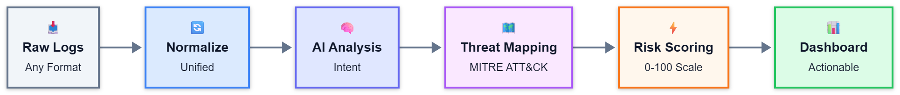

# Cognitive Context Enrichment (CCE) Pipeline



**CCE** is an AI-powered microservices architecture designed to modernize Security Operations Center (SOC) workflows. It acts as an intelligent enrichment layer that sits on top of traditional SIEMs, transforming raw, noisy logs into actionable, context-rich security alerts.

Unlike standard rule-based detection, CCE leverages a hybrid approach combining deterministic logic (Sigma rules) with probabilistic AI (LLMs & Vector Embeddings) to understand the *intent* behind an event, map it to the MITRE ATT&CK framework, and calculate a dynamic risk score.

## 🏗️ Architecture

The system is built as a set of Dockerized Python FastAPI microservices, orchestrated to process logs in real-time:

### 1. 📥 Log Ingestion & Normalization (`log_ingestion`)
*   **Role:** The entry point for raw data.
*   **Function:** Detects log types (Windows Event Logs, Sysmon, Auditd, Syslog) and normalizes them into a standard JSON schema, extracting critical fields like timestamps, users, and hostnames.

### 2. 🧠 Semantic Interpreter (`semantic_interpreter`)
*   **Role:** The "understanding" layer.
*   **Function:** Uses Large Language Models (LLMs) to analyze the natural language context of a log message. It extracts semantic features (operation type, resource targeted, direction) that regex often misses.

### 3. 🎯 Intent Classifier (`intent_classifier`)
*   **Role:** The decision engine.
*   **Function:** Determines the attacker's goal (e.g., *Credential Dumping*, *Lateral Movement*). It uses a hybrid engine:
    *   **Rule-Based:** Strict YAML/Sigma-style rules for known threats.
    *   **LLM Fallback:** AI analysis for ambiguous or novel threats that rules miss.

### 4. 🗺️ MITRE Reasoner (`mitre_reasoner`)
*   **Role:** The strategic mapper.
*   **Function:** Uses RAG (Retrieval-Augmented Generation) with a Vector Database (ChromaDB) to map the analyzed event to specific **MITRE ATT&CK** techniques and tactics, providing industry-standard context.

### 5. 🎼 Orchestrator (`orchestrator`)
*   **Role:** The conductor.
*   **Function:** Manages the workflow between all services. It aggregates data, handles failures gracefully, calculates a final **Risk Score** (0-100), and generates a human-readable narrative summary and remediation recommendations.

### 6. 💻 Frontend Dashboard (`frontend`)
*   **Role:** The analyst interface.
*   **Function:** A modern React + Tailwind + ShadCN UI that visualizes the pipeline steps, displays the risk gauge, and allows analysts to manually submit logs for instant analysis.

## 🚀 Key Features
*   **Hybrid AI/Rule Engine:** Combines the speed of rules with the flexibility of LLMs.
*   **MITRE ATT&CK Mapping:** Automatic mapping of events to TTPs.
*   **Dynamic Risk Scoring:** Scores events based on semantic severity, not just static keywords.
*   **Microservices Design:** Fully containerized with Docker Compose for easy scaling and deployment.
*   **Resilient:** Designed to handle downstream failures without crashing the pipeline.

## 🛠️ Tech Stack
*   **Backend:** Python, FastAPI, Pydantic, Uvicorn
*   **AI/ML:** Groq API (LLM), ChromaDB (Vector Store), LangChain
*   **Frontend:** React, TypeScript, Vite, TailwindCSS, ShadCN UI
*   **Infrastructure:** Docker, Docker Compose, Nginx

## 🏁 Getting Started

### Prerequisites
*   Docker Desktop installed and running.
*   A Groq API Key (for LLM functionality).

### Installation

1.  **Clone the repository:**
    ```bash
    git clone https://github.com/hamagharbi/Cognitive-Context-Enrichment-for-SOC-SIEM.git
    cd Cognitive-Context-Enrichment-for-SOC-SIEM
    ```

2.  **Configure Environment Variables:**
    Create a `.env` file in the root directory. You must add your Groq API key. You can also configure optional settings:
    ```env
    # Required
    GROQ_API_KEY=your_groq_api_key_here

    # Optional (Defaults provided in code)
    ORCHESTRATOR_TIMEOUT=30
    ORCHESTRATOR_LOG_LEVEL=INFO
    INTENT_RULE_CONFIDENCE_THRESHOLD=0.7
    INTENT_LLM_FALLBACK_ENABLED=true
    ```

3.  **Build and Run with Docker Compose:**
    ```bash
    docker-compose up --build
    ```

4.  **Access the Application:**
    *   **Frontend Dashboard:** [http://localhost:3000](http://localhost:3000)
    *   **Orchestrator API Docs:** [http://localhost:8000/docs](http://localhost:8000/docs)

## 📖 How It Works

1.  **Submission:** An analyst submits a raw log (e.g., a suspicious PowerShell command) via the Frontend or API.
2.  **Ingestion:** The `log_ingestion` service identifies the format (e.g., Windows Event Log) and parses it into a structured JSON object.
3.  **Interpretation:** The `semantic_interpreter` analyzes the text to understand *what* is happening (e.g., "A process is attempting to execute a hidden command").
4.  **Classification:** The `intent_classifier` checks if this behavior matches known attack patterns (Sigma rules) or looks suspicious to the AI model.
5.  **Contextualization:** The `mitre_reasoner` searches its vector database to find which MITRE ATT&CK technique this behavior corresponds to (e.g., T1059.001 PowerShell).
6.  **Scoring & Reporting:** The `orchestrator` compiles all findings, calculates a risk score based on the severity of the intent and technique, and generates a summary with recommendations.
7.  **Visualization:** The result is displayed on the dashboard with a risk gauge and detailed breakdown.

## 📂 Project Structure

```
├── frontend/               # React application
├── orchestrator/           # Main API gateway and logic coordinator
├── log_ingestion/          # Log parsing and normalization service
├── semantic_interpreter/   # LLM-based log analysis service
├── intent_classifier/      # Hybrid rule/AI intent detection service
├── mitre_reasoner/         # RAG-based MITRE mapping service
└── docker-compose.yml      # Container orchestration config
```
